# Case A: NATなし（Publicのみ）で ECS(Fargate)+ALB を最小成立させる（障害対応Runbook付き）

## 概要
このドキュメントは「NATなし（Publicのみ）」という制約下で、**ECS（Fargate）+ ALB** を最小構成で成立させ、**再現手順・検証・削除**に加えて、**障害対応Runbook（切り分け手順）** までを一気通貫でまとめたものです。

要点は以下です。
- タスクを **Public Subnet** に配置し **Assign public IP = ENABLED** にする（本Caseの成立条件）
- **Task SG の inbound を ALB SG のみに限定**し、タスク直叩きを遮断する
- 不具合時は Runbook の順序で **観測→仮説→検証→対処→再発防止** を行う

成果物：ALB 経由で nginx を公開し、Target Group が Healthy になり、CloudWatch Logs（nginxログ）でヘルスチェック到達を観測できる状態を構築する。  
非目的：本番相当の HTTPS/WAF/アクセスログ長期保管/AutoScaling 等は扱わない（最小成立条件の検証が目的）。  
補足：本番では **TLS（ACM）、WAF（要件次第）、ALBアクセスログ（S3）** を検討対象とする。

参照リンク（このmd内）
- ALB DNS（環境削除済みのためプレースホルダ）：`http://<ALB-DNS>/`
- [検証結果（成立証跡）](#result)
- [障害対応-runbook切り分け手順](#runbook)
- [つまずき（実例）](#miss)
- [削除完了チェック](#delete) 
- [まとめ](#summary)

---

## 命名規則（本リポジトリ共通）
- `pf-`：portfolio の prefix
- `-1`：Case番号（例：Case A は `-1`）
- 例：
  - VPC：`pf-vpc-1`
  - Public Subnet：`ap-northeast-1a / 1c`
  - ECS Cluster：`pf-ecs-cluster-1`
  - Task definition：`pf-task-nginx-1`
  - ALB：`pf-alb-1`
  - Target group：`pf-tg-1`
  - ALB SG：`pf-sg-alb-1`
  - Task SG：`pf-sg-task-nginx-1`
  - Log group：`/ecs/pf-task-nginx-1`

---

## 目的
- NATなし（Publicのみ）で ECS（Fargate）+ ALB を成立させる「最小の型」を作る
- 障害対応の順序（Runbook）を作成する

---

## スコープ固定（Case A の定義）
- Subnet：**Public Subnet を使用（2AZ）**
  - Public Route Table：`0.0.0.0/0 -> Internet Gateway`
- NAT Gateway：なし
- VPC Endpoint：なし
- ALB：Internet-facing（HTTP:80）
- ECS Task（Fargate）：
  - **Public Subnet に配置**
  - **Assign public IP = ENABLED（本Caseの成立条件）**
  - ※ NAT/Endpoint がないため、コンテナイメージ取得など外部への通信を Public IP で成立させる前提

---

## 構成
- VPC（Public Subnet x2 / Private Subnet x2）
  - ※ Private Subnet は作成してもよいが、本Case（A）では使用しない
- Internet Gateway
- ECS Cluster（Fargate）
- ALB
- CloudWatch Logs（nginx access/error）

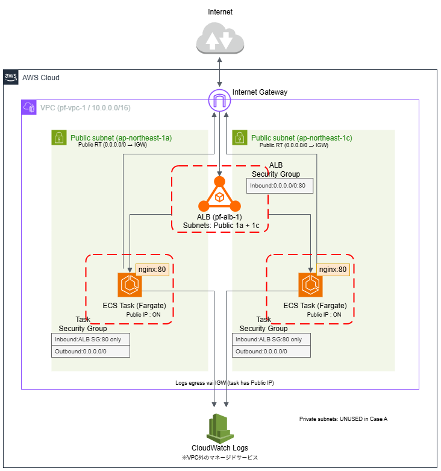

---

## 手順（再現可能）

### 0. 事前準備（最低限）
- Root アカウントの MFA 有効化
- 管理用 IAM ユーザー作成 + MFA
- AWS Budgets でアラート（例：月 $10、85%/100%）

### 1. セキュリティグループ方針（Case A の要点）
- ALB SG：
  - Inbound：HTTP 80 from `0.0.0.0/0`
- Task SG：
  - Inbound：HTTP 80 from **ALB SG のみ**
  - ※ Task SG に `0.0.0.0/0:80` は残さない

### 2. VPC 作成（NATなし）
- VPC and more
- AZ：2
- Public Subnet：2
- Private Subnet：2
- NAT Gateway：なし
- VPC Endpoint：なし
- Name：pf-vpc-1

- ※このウィザードにより **Public 2 + Private 2 の計4サブネット**が作成される。
- ※ただし Case A では NAT/Endpoint を使わないため、ECS サービス作成時のサブネット選択は **Public 2つのみ**とし、Private は選択から外す。

### 3. ECS Cluster 作成（Fargate only）
- Cluster：pf-ecs-cluster-1
- Capacity provider：Fargate only

### 4. タスク定義作成（nginx）
- Task definition：pf-task-nginx-1
- Launch type：Fargate
- Network mode：awsvpc
- OS/Arch：Linux/x86_64
- Task size：
  - Task CPU：256
  - Task Memory：512 MiB
- Container：
  - Name：nginx
  - Image：nginx:1.28.1（タグ固定）
  - Port mapping：
    - containerPort：80
    - hostPort：80
    - protocol：tcp
- Logs（CloudWatch Logs / awslogs）：
  - awslogs-group：/ecs/pf-task-nginx-1
  - awslogs-region：ap-northeast-1
  - awslogs-stream-prefix：ecs
  - awslogs-create-group：true
- IAM role：
  - Task execution role：ecsTaskExecutionRole（自動作成）
    - 補足：ecsTaskExecutionRole は **ECR pull と CloudWatch Logs 出力**に必要
  - Task role：未設定（本Caseでは AWS API を呼ばないため不要）

### 5. サービス作成（ECS Service）+ ALB 作成
- Desired tasks：1
- Networking：
  - VPC:pf-vpc-1 を選択
  - Subnet：**Public Subnet x2 のみを選択**
    - もし Private Subnet が混ざっていたら **×で外す**
  - Security group：Task SG を新規作成（`pf-sg-task-nginx-1`）※後で締める前提の仮SG
  - **Public IP：ON（本Caseの成立条件）**
- Load balancing：
  - Application Load Balancer：有効、新規作成（`pf-alb-1`）
  - Listener：HTTP:80
  - Target group：新規作成（`pf-tg-1`）
  - Target type：IP (ALB 作成時にない可能性あり）
  - Health check：path `/`（デフォルト想定）

### 6. SG を最終形に締める（必須）
- ALB SG：
  - Inbound：HTTP 80 from `0.0.0.0/0`
- Task SG：
  - Inbound：HTTP 80 from **ALB SG のみ**
  - もし `0.0.0.0/0:80` が入っていれば削除する

### 7. 動作確認（合否判定）
- ALB の DNS 名へアクセスし、nginx の Welcome Page が表示されること  
  例：`http://<ALB-DNS>/`
- Target group `pf-tg-1` の Target が **Healthy** であること

---

## 検証結果（成立証跡）
以下が揃っていることをもって Case A は成立とする。

- ALB DNS へアクセスして nginx の Welcome Page が表示された  
  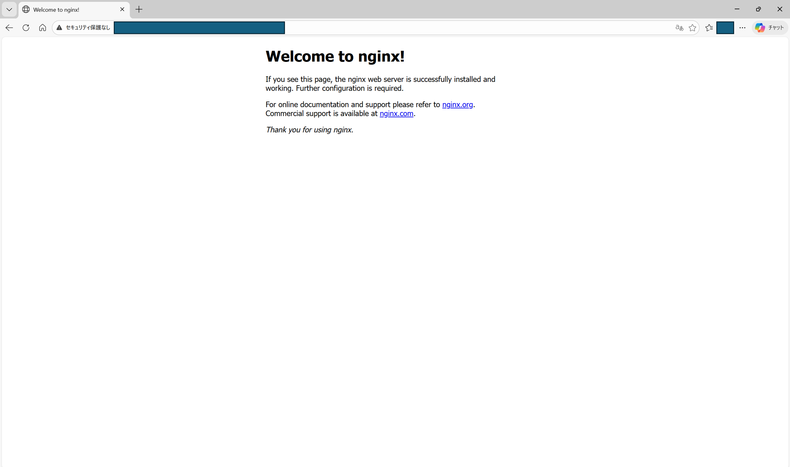

- Target Group が Healthy（ECS task が正常に登録されている）
  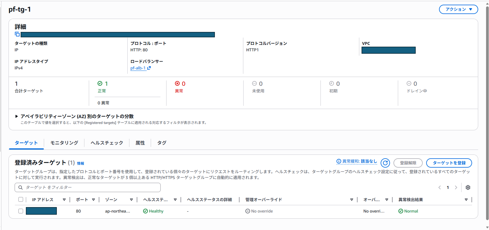

- CloudWatch Logs（nginx access log）に、User-Agent が `ELB-HealthChecker/2.0` のアクセスが継続して出ている  
  これは「ALBのアクセスログ」ではなく「nginx側が受けたリクエストのログ」
  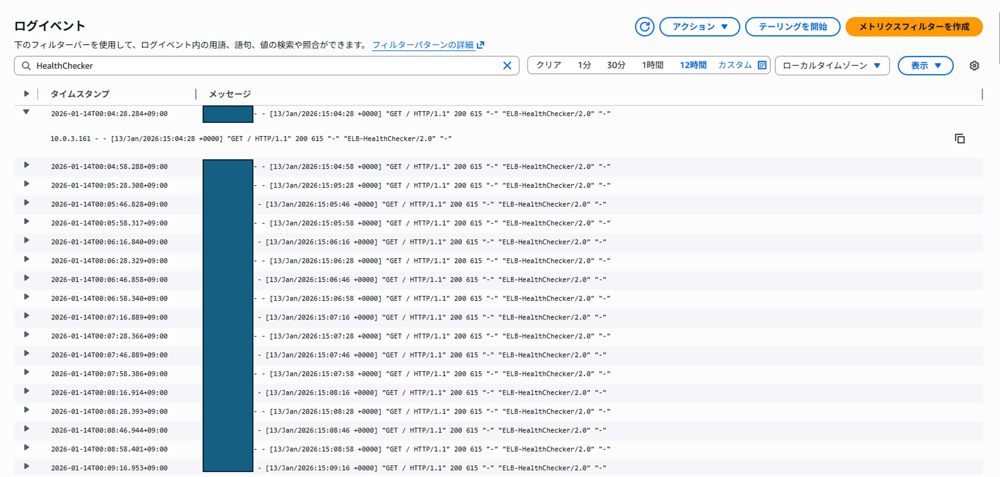

## 追加検証：異常系（404 応答とログ観測）
意図的に存在しないパスへアクセスし、ALB→Task→nginx まで到達して **404 が返ること**、および **nginx のログに記録されること**を確認する。

- 手順：
  - `http://<ALB-DNS>/favicon.ico`（存在しない想定）へアクセスする
- 期待結果：
  - ブラウザ（または curl）で 404 が返る
  - CloudWatch Logs（nginx access/error）に該当リクエストが記録される
- 観測ログ例：
  - error log：`open() "/usr/share/nginx/html/favicon.ico" failed (2: No such file or directory)`
  - access log：`"GET /favicon.ico HTTP/1.1" 404 ...`

  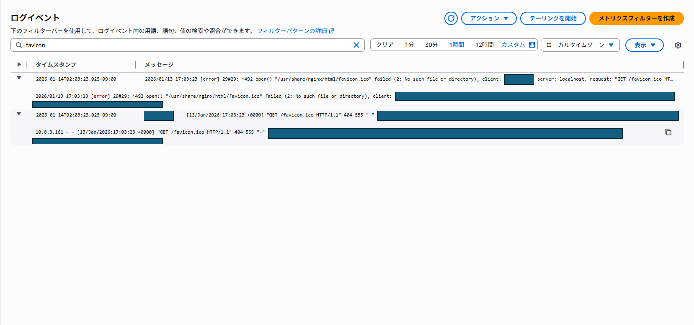

補足：404 が返ることは「到達している」証拠であり、必ずしも障害ではない。意図した異常系テストとして分類する。

---

## 障害対応 Runbook（切り分け手順）

### 0) まず固定する順序（迷子防止）
1. **ECS events / stopped reason** で「止まっている理由」を取る  
2. **Target Group の health reason** で「ALB→Task が何で失敗しているか」を取る  
3. **Security Group / Port / HealthCheck** の設計ミスを潰す  
4. **CloudWatch Logs（nginxログ）** で「実際に到達しているか」を確かめる

---

### R1. 症状：タスクが起動しない（PENDINGのまま / STOPPEDになる）
**観測ポイント**
- ECS Service の Events
- 対象 Task の “Stopped reason”
  - 例：`CannotPullContainerError` / `ResourceInitializationError` / `Essential container in task exited`

**よくある原因と対処**
- `CannotPullContainerError` / `pull image ...` 系  
  - 原因：外部へ通信できない（Public IP OFF / ルート不備）
  - 対処：**Assign public IP = ENABLED** を確認。サブネットの `0.0.0.0/0 -> IGW` を確認
- `ResourceInitializationError` など  
  - 原因：実行ロール不足、初回利用時の揺らぎ、設定不整合
  - 対処：ecsTaskExecutionRole の存在確認 → 失敗スタック削除 → 再作成

**再発防止（固定）**
- サービス作成時に Public IP を必ず ON
- 最初に ECS events を見る（順序を崩さない）

---

### R2. 症状：Target Group が Unhealthy（ALB経由で表示されない）
**観測ポイント**
- Target Group → Targets の “理由”
  - 例：`Health checks failed` / `Request timed out`（通信経路・SG・ポート・ヘルスチェック不整合の示唆）

**前提チェック（最優先）**
- Case A は **Public Subnet 2つのみ**を選ぶ。Private Subnet が混入していたら **×で外す**。

**切り分け（この順）**
1) **Task SG inbound が ALB SG になっているか**
2) **ポート整合**（Listener 80 / TG 80 / containerPort 80）
3) **ヘルスチェック整合**（path `/`、成功コード想定がズレていないか）

**対処**
- ALB 作成後に SG が確定してから、Task SG inbound を **ALB SG のみに**締める
- nginx access log に `ELB-HealthChecker/2.0` が来ているか確認
  - 来ていない：SG/ルート/ポートの可能性が高い
  - 来ているのに Unhealthy：ヘルスチェック設定（path/コード）を疑う

---

### R3. 症状：ALBにアクセスすると 502 / 504
**分岐**
- TG が Unhealthy → R2 へ  
- TG が Healthy → アプリ応答を疑う（タスク再起動/ログ/設定）

---

### R4. 症状：CloudWatch Logs が出ない（ロググループ/ストリームが見えない）
**観測ポイント**
- `/ecs/pf-task-nginx-1` が作成されているか
- タスクが実際に RUNNING か（RUNNINGでないなら R1）

**原因と対処**
- awslogs 設定漏れ：タスク定義のログ設定を再確認  
- Execution role 不備：ecsTaskExecutionRole（Logs write）の確認  
- タスク停止：R1 に戻る（ログが出ないのは “動いていない結果” のことが多い）

---

### R5. 最短復旧チェックリスト
- [ ] ECS events / stopped reason を読む
- [ ] サブネット選択が Public 2つのみ（Private が混入していない）
- [ ] Assign public IP が ON（Case A の成立条件）
- [ ] TG reason を読む（Unhealthy の理由を文字で取る）
- [ ] Task SG inbound が ALB SG のみ
- [ ] ポート/ヘルスチェックが揃っている
- [ ] nginxログで到達確認（HealthChecker が見えるか）

---

## つまずき（実例）

### つまずき1：ECS Cluster 作成が service-linked role で失敗
- 現象：`Unable to assume the service linked role` で `CREATE_FAILED`
- 観測：IAM に `AWSServiceRoleForECS` が作成されていることを確認
- 原因：初回の ECS 利用では service-linked role 周辺が整うまでタイミング差が出る場合がある
- 対処：失敗スタック削除 → 数分待って再実行 → 成功
- 再発防止：初回は「ロール確認 → 失敗スタック削除 → 再実行」を手順に含める

  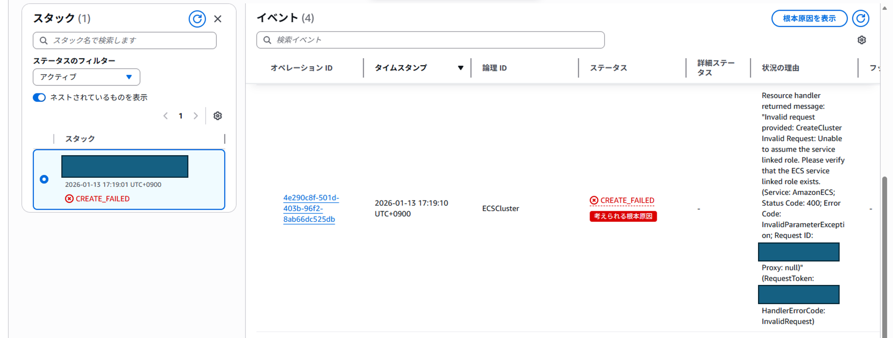

### つまずき2：Task SG inbound が ALB SG 未設定で Target が Unhealthy
- 現象：デプロイは進むが Target が Unhealthy
- 観測：Task SG inbound が ALB SG のみに締まっていなかった
- 原因：サービス作成前は ALB SG が確定しておらず、「ALB SG をソースにして Task SG を締める」を先に完了できない場合がある
- 対処：
  1. ALB 作成後に ALB SG のIDを特定（今回は:sg-093*****）
  2. Task SG inbound を **ALB SG のみに**修正
- 再発防止：
  1. **「ALB 作成後に Task SG を締める」** を手順として明記
  2. **#2 PVC作成後に、SG を作成する** 手順に変更し、構造的につまずきにくい形に変更する。（推奨）Case-Bからはこれで実施

  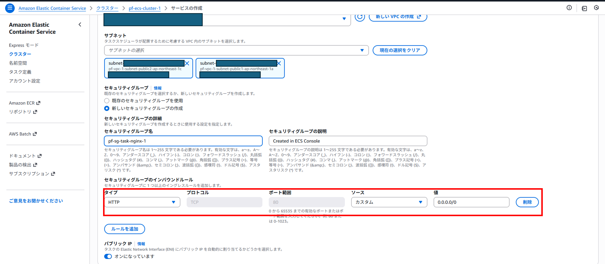
  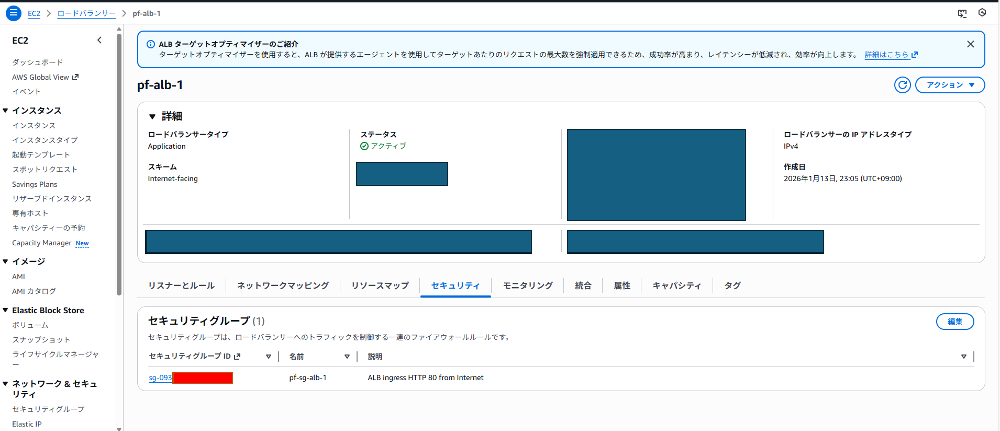
  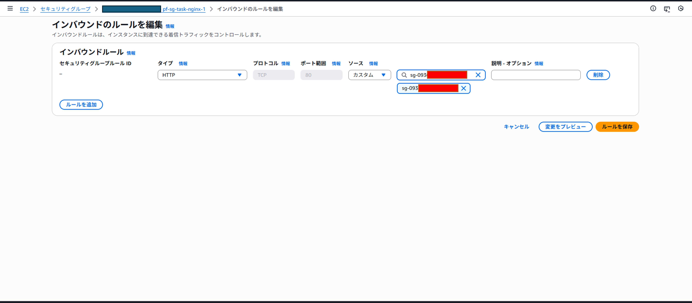

---

## コスト（固定費 / 従量）
- 固定費：NAT Gateway（未使用のため $0）
- 従量：Fargate（CPU/Memory/実行時間）、ALB（時間＋LCU）、CloudWatch Logs（取り込み・保存）
- 学習用途でも放置すると積み上がるため、終わったら削除する

---

## 削除手順
1. ECS のサービス/タスクを停止・削除
2. ALB を削除（Listener はALB削除で消える。Target group は残る場合があるため別途削除）
3. セキュリティグループを削除（ALB SG / Task SG）
4. CloudWatch Logs のロググループを削除（`/ecs/pf-task-nginx-1`）
5. CloudFormation スタックを削除（コンソール作成で生成された場合）
6. VPC を削除（依存が残ると消えないため、残存 ENI / TG / SG を順に削除）

---

## 削除完了チェック
削除作業後、以下が満たされていることを確認した。

- ECS（最初に確認）
  - Cluster `pf-ecs-cluster-1` に **Service が 0**、**Running task が 0** 確認後、削除
    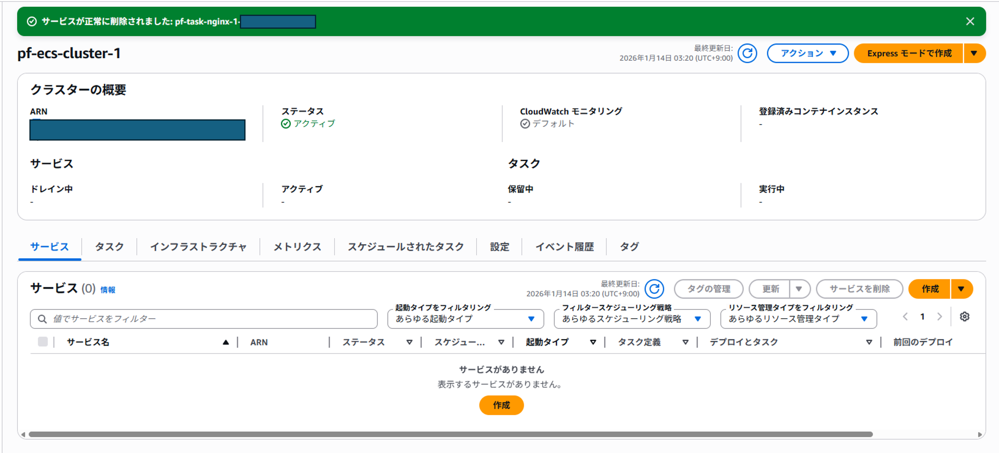

- ELB / Target group
  - EC2 → Load Balancers に対象 ALB が存在しない
  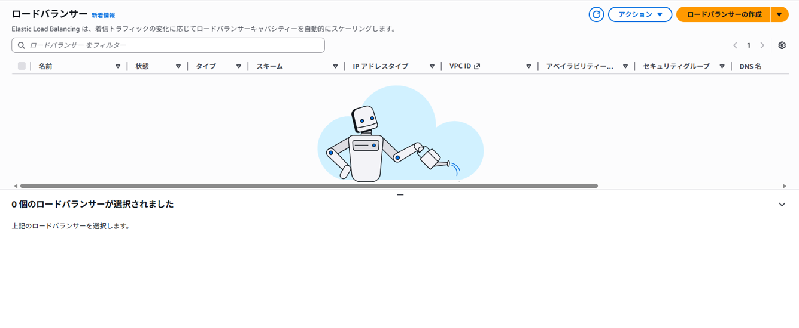
  - EC2 → Target Groups に対象 TG（`pf-tg-1`）が存在しない  
    ※ALB 削除後も TG が残るケースがあるため別途確認
  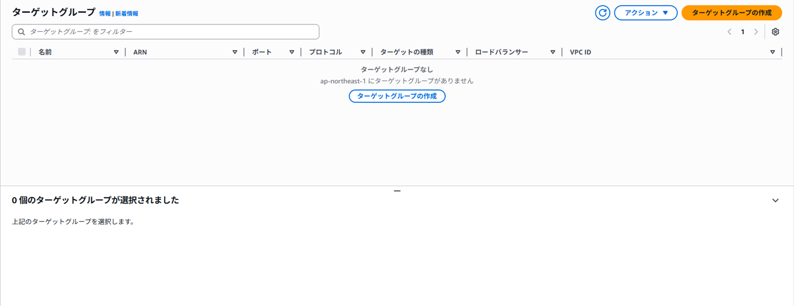

- Security group
  - `pf-sg-alb-1`  が存在しない  
    ※スクショではチェックが入っているが、VPC の default SG は削除対象ではない（通常削除不可）
  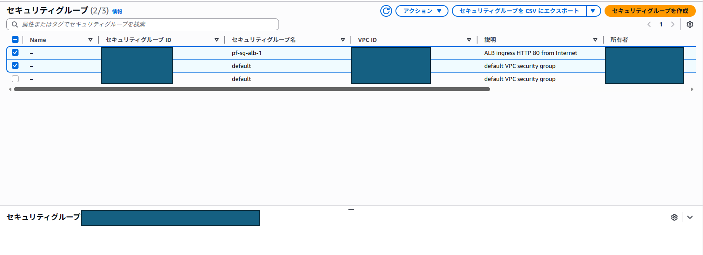
  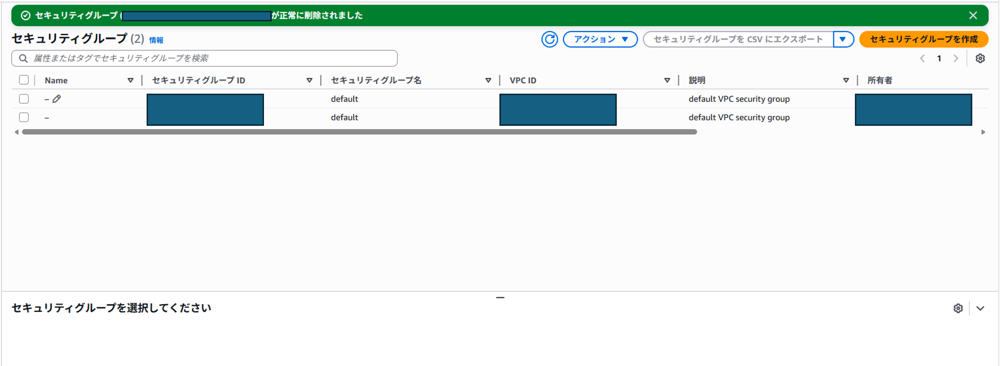

- CloudWatch Logs
  - `/ecs/pf-task-nginx-1` が（不要なら）削除されている
  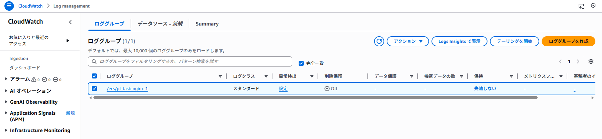
  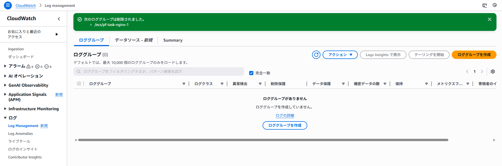

- CloudFormation（ECS コンソール作成で生成された場合）
  - CloudFormation → Stacks に関連スタックが残っていない（`DELETE_COMPLETE` を含め、残したくない場合は削除）
  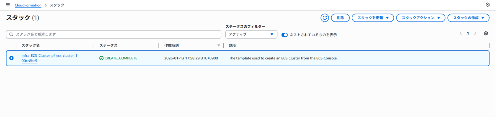
  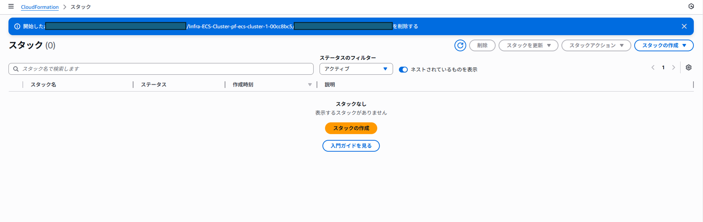

- VPC
  - `pf-vpc-1` が削除され、VPC 一覧に存在しない
  - VPC が削除できない場合は、残存リソース（ENI / SG / ルートテーブル関連付け / IGW / サブネット等）を逆引きして先に削除
  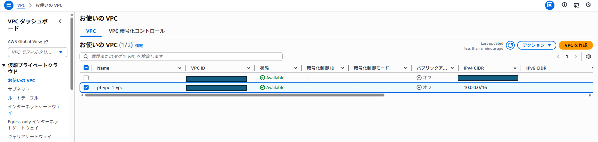
  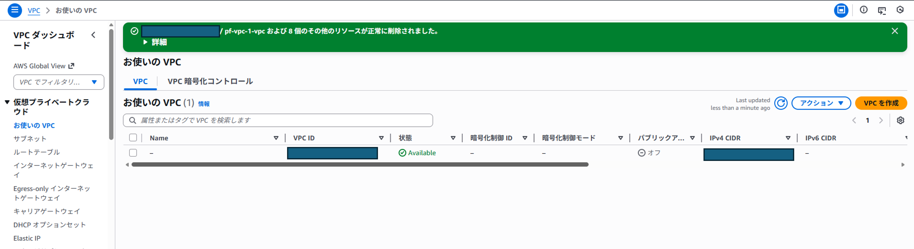

- ECS（最終確認）
  - （削除済みなら）Cluster 自体が一覧から消えている
  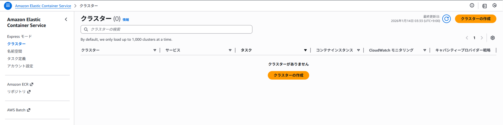

---

## まとめ
- NATなし（Publicのみ）でも、**Public IP を前提に** ECS（Fargate）+ ALB の最小構成は成立する
- 要点は「入口（ALB）と実行（Task）を分離し、**Task SG inbound を ALB SG のみに限定**する」こと
- Runbook を用意すると、同じ障害が起きても **観測→切り分け→対処→再発防止** を一定の順序で実行できる
- 次は Case B（Private + NAT を含む構成）で、Private 側の成立条件と切り分けを拡張する
