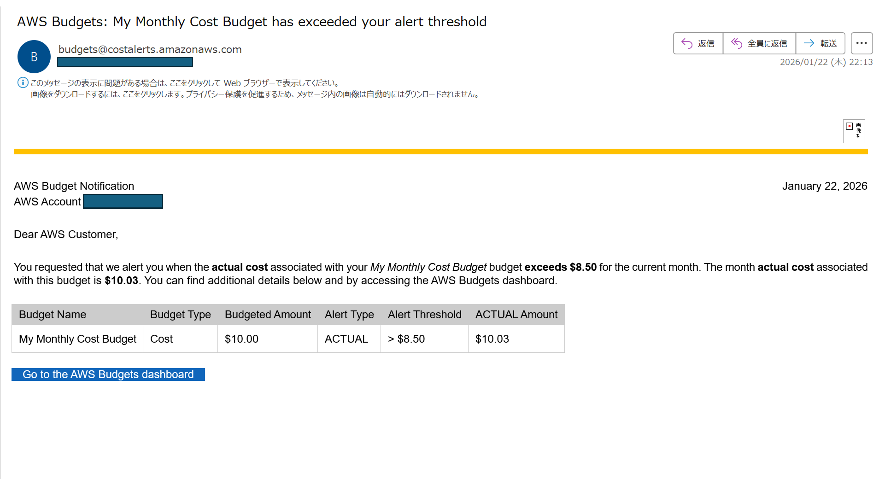
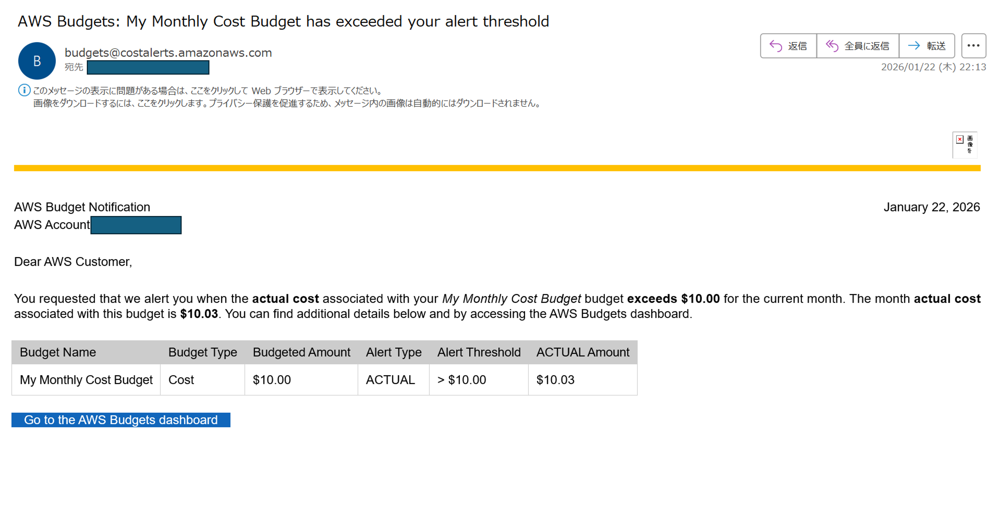
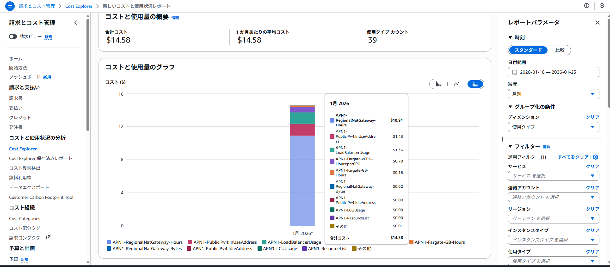
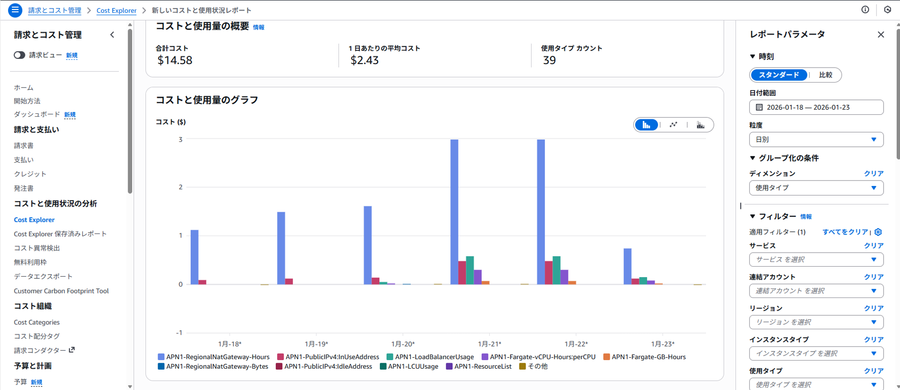
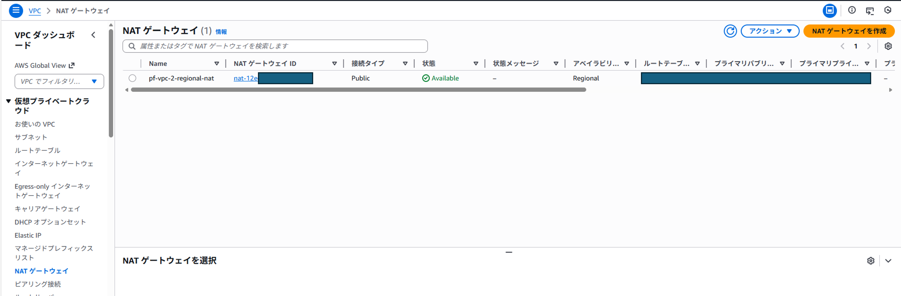
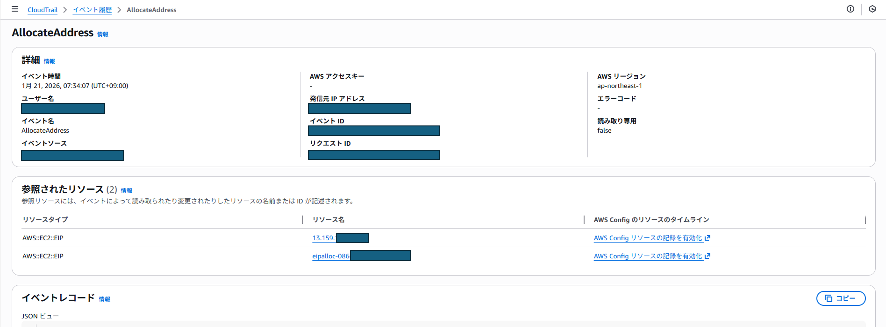
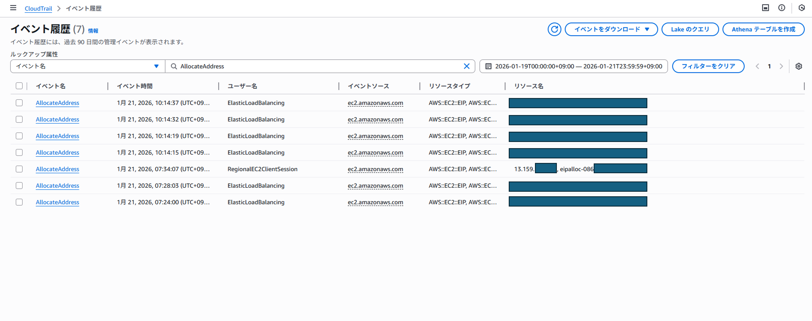
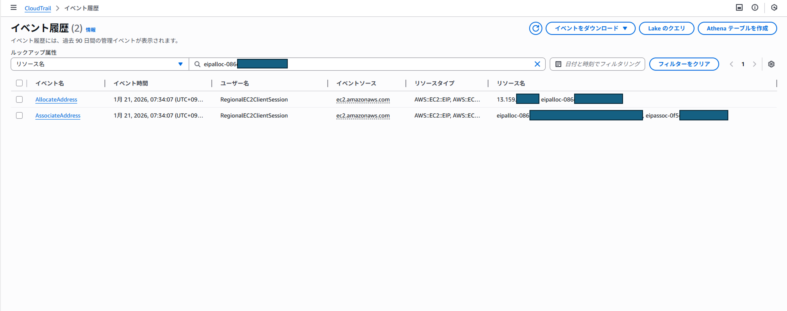
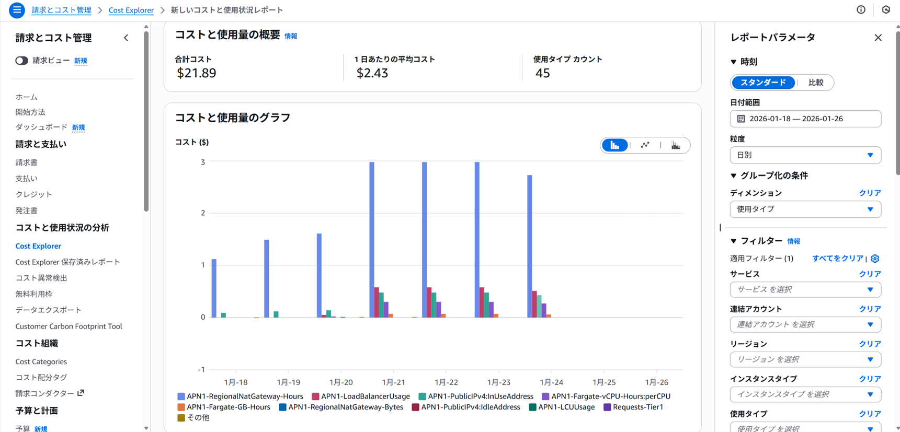
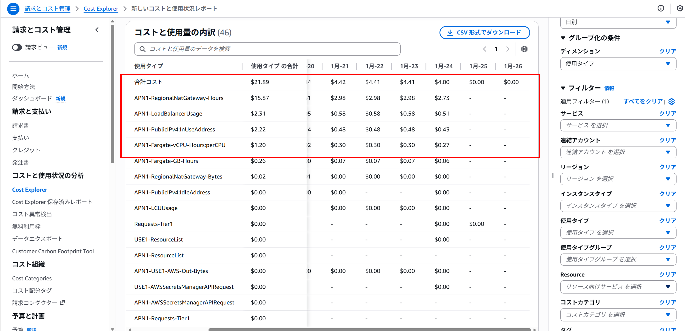

# コスト検証ポートフォリオ：Case B（NATあり / Private Task）における放置コストの確定

## 概要
ECS(Fargate)+ALB の検証環境を意図的に「放置」し、コストが増加する要因を **Cost Explorer（使用タイプ）→ CloudTrail（イベント）→ リソース画面（残存確認）** の順に突合して確定した。  
結論として、通信量ではなく **NAT Gateway / ALB / Fargate の時間課金** と **Public IPv4（InUse）** が支配要因であり、特に **Regional NAT（service-managed: rnat）** が関与する EIP は短期では自動解放されず残存し得ることを確認した。

---

## 目的
- 検証環境の放置が生むコストを、推測ではなく **根拠（イベント・残存リソース）** で説明できるようにする
- 「何を消せば止まるか」をチェックリスト化し、再現性のある運用に落とす

---

## スコープ固定
- 対象：Case B（NATあり / Private Subnet に Fargate Task を配置）
- リージョン：ap-northeast-1（東京）
- 期間：2026-01-18～2026-01-23（Cost Explorer の日別集計）
- 補足：
  - 2026-01-24 は当日であり、Cost Explorer 側の集計遅延があり得るため、表は 1/23 までを掲載する
  - Cost Explorer の「日別」は UTC 基準表示になる場合があり、JST の作業日時と日付がずれる可能性がある

---

## データソース
- Cost Explorer（新しいコストと使用状況レポート）
  - 粒度：日別
  - フィルタ：サービス（EC2-Other / VPC / ECS / Elastic Load Balancing 等）
  - グループ化：使用タイプ
- CloudTrail（イベント履歴）
  - 重要イベント：`CreateNatGateway` / `AllocateAddress` / `AssociateAddress`
- EC2（Elastic IP）
  - EIP 詳細画面で `allocationId` / `associationId` / `Service managed` を確認

## コストアラート受信と初動対応（AWS Budgets）

本検証では、Case A/B 共通の前提として AWS Budgets により月額予算とアラート閾値を設定している。今回の調査は、Budgets からの通知（予算超過）を起点に実施した。

- 予算：月額 $10.00（Cost Budget）
- アラート（実績ベース / ACTUAL）
  - 85%：$8.50 超過で通知
	 

  - 100%：$10.00 超過で通知
	 
- 受信内容：2026/01/22 時点で当月実績 $10.03（閾値超過）。どちらも同時刻にアラートメールが来た。

### 初動対応方針（運用としての優先順位）

通知を受けた時点で、まず「継続的に増え続ける固定費（時間課金・InUse課金）」を優先して疑い、原因の確定に着手した。

1. Cost Explorer を日別で確認し、増加日（スパイク日）を特定する  
2. サービス単位（EC2-Other / VPC / Elastic Load Balancing / ECS）で上位項目を絞る  
3. グループ化を「使用タイプ」に切り替え、支配項目（NATGW-Hours / PublicIPv4 InUse / LoadBalancerUsage / Fargate）まで分解する  
4. CloudTrail で関連イベント（CreateNatGateway / AllocateAddress / AssociateAddress）を確認し、「何が増えたか」を推測ではなく確定する  
5. リソース画面（NAT / Elastic IP / ALB / ECS）で現時点の残存を確認し、止血対象を確定する  

この流れにより、請求上の増加要因を「Cost Explorer の集計」だけで終わらせず、イベントと残存リソースの突合により説明可能な証拠として整理した。

**今回は実際のコスト感を把握するために 意図的にそのまま2日間放置してみた。**

---

## 観測結果（Cost Explorer：日別×主要使用タイプ）
主要な支配項目（NAT / Public IPv4 / ALB / Fargate）を抜粋した。

 
 

| 日付(UTC)   |   NATGW Hours    |   PublicIPv4 InUse    | ALB Hours      | Fargate vCPU      | Fargate Memory      |   NAT DataProc    |  合計($)  |
|:------------|-----------------:|----------------------:|:---------------|:------------------|:--------------------|------------------:|----------:|
| 2026-01-18  |            1.116 |              0.086444 | -              | -                 | -                   |          0        |   1.20255 |
| 2026-01-19  |            1.488 |              0.12     | -              | -                 | -                   |          0        |   1.60801 |
| 2026-01-20  |            1.612 |              0.142693 | 0.048600       | 0.020032          | 0.004382            |          0.011499 |   1.83947 |
| 2026-01-21  |            2.976 |              0.481824 | 0.583200       | 0.303360          | 0.066360            |          0.003312 |   4.41645 |
| 2026-01-22  |            2.976 |              0.48     | 0.583200       | 0.303360          | 0.066360            |          0.003392 |   4.41239 |
| 2026-01-23  |            0.744 |              0.12     | 0.145800       | 0.075840          | 0.016590            |          0.000843 |   1.10308 |

### 読み取り
- **NATGW Hours** が最大の固定費要因（例：1月 は $10.91/6日 特に1/21・1/22 は $2.976/日）
- **PublicIPv4 InUse** が次点（例：1月 は $1.43/6日）
- **ALB Hours** が次々点（例：1月 は $1.36/4日）
- **ALB Hours** と **Fargate（vCPU/Memory）** は「稼働し続ける」ことで増える（1/21・1/22 が顕著）
- **NAT DataProc（Bytes）** は非常に小さく、今回は通信量は支配要因ではない

### 補足（NATGW-Hours の日次値が規則的に見える理由）
- 1/19 の NATGW-Hours は $1.488/日で、時間単価 $0.062/時 × 24時間 に一致する（フル稼働の固定費に相当）
- 1/18 の NATGW-Hours は $1.116/日で、同日中に NAT を作成した「部分日」の可能性が高い（後述の CloudTrail と整合）

---

## 原因確定（CloudTrail：EIP 自動確保の発生を特定）
Cost Explorer だけでは「台数増」等の誤読が起き得るため、CloudTrail で **何が起きたか**を確定した。

### 1) NAT Gateway 作成（Case A の残骸ではなく Case B 起因）
- イベント：CreateNatGateway
- 発生：2026-01-18 06:40:02Z（JST 15:40:02）
- 生成：`nat-12e**********`
- 特徴：`availabilityMode = regional`（Regional NAT）

これにより、1/18 以降の NAT 関連コストは Case A の残存ではなく、Case B の NAT 作成に起因すると説明できる。

### 2) Regional NAT（serviceManaged=rnat）が EIP を自動確保・関連付け
- イベント：AllocateAddress（実行主体：AWSServiceRoleForNATGateway / RegionalEC2ClientSession）
  - `serviceManaged: rnat`
  - `allocationId: eipalloc-086**********`
  - `publicIp: 13.159.***.***`
  - `autoRelease: true`

- イベント：AssociateAddress（同時刻に発生）
  - `associationId: eipassoc-0f5**********`

**結論**：Regional NAT が自動的に EIP を確保し、即時に関連付けた事実が CloudTrail で確定した。

### 3) ALB（serviceManaged=alb）も EIP を自動確保している
同期間に ElasticLoadBalancing サービスロールが `AllocateAddress` を複数回実行している（`serviceManaged: alb`）。  
Public IPv4（InUse）増加の要因は NAT 側だけでなく、ALB 側の自動確保も絡み得る。

---

## 残存確認（EC2：Elastic IP）
CloudTrail の `allocationId` / `associationId` をキーに、EC2 の EIP 詳細で現時点の状態を確認した（2026-01-24 時点）。

- Elastic IP：13.159.*** .***
- `allocationId: eipalloc-086**********`（CloudTrail と一致）
- `associationId: eipassoc-0f5**********`（CloudTrail と一致）
- `Service managed: rnat`

これにより、該当 EIP は短期（少なくとも 1/24 時点）では自動解放されず残存し得ることが確認でき、Public IPv4（InUse）課金の継続要因として説明可能になった。

### コスト感（放置時の危険度の目安）

本検証では、最大日次が約 $4.41（2026-01-21/22）まで上昇した。仮に同程度の状態を維持したまま放置した場合、単純計算で $4.41 × 30日 ≒ `$132/月` に到達し得る。  
このため、検証は「構築して疎通確認」までではなく、「停止・削除までを作業範囲に含める」必要がある。

---

## 誤読しやすいポイント（本検証での学び）
- Cost Explorer の規則的な日次値のみから「NAT Gateway の台数が増加した」と断定するのは危険である。  
  → 本検証では NAT Gateway は 1 つ（`nat-12e**...`）である一方、Regional NAT（service-managed: rnat）の自動管理（EIP/ENI の追加等）により、`NATGW-Hours` が増加して見える局面があった。したがって、台数や増加要因は **CloudTrail とリソース画面の突合により確定**する必要がある。
- `autoRelease: true` は「短期で必ず解放される」ことを意味しない。  
  → 本検証では CloudTrail 上で Disassociate/Release を確認できない期間があり、かつ EC2 の Elastic IP 画面で service-managed（rnat）の EIP 残存を確認した。
- アラートは「請求が増えている」事実の通知であり、原因の説明にはならない。  
  → 通知を起点に、Cost Explorer（使用タイプ）で支配項目を特定し、CloudTrail とリソース残存確認で同定することで、運用として説明可能な状態にする必要がある。

---

## 再現可能な調査手順（テンプレ）
1. Cost Explorer → 日別 → グループ化「使用タイプ」
   - `RegionalNatGateway-Hours` / `PublicIPv4:InUseAddress` / `LoadBalancerUsage` / `Fargate` を抽出
2. CloudTrail（イベント履歴）
   - NAT：`CreateNatGateway` / `AllocateAddress` / `AssociateAddress`（`serviceManaged=rnat`）
   - ALB：`CreateLoadBalancer` / `AllocateAddress` / `AssociateAddress`（`serviceManaged=alb`）
3. EC2 → Elastic IP
   - `allocationId` をキーに、`Service managed` と残存を確認

---

## 対応方針（暫定対処と恒久対策）

### 暫定対処（止血：課金の増加を止める）

アラート受信後は、まず「時間課金」「InUse課金」を止めることを優先し、以下を確認・停止対象として扱う。

- NAT Gateway：存在すれば最優先で停止・削除対象（NATGW-Hours が支配要因となるため）
- Elastic IP：Service-managed を含め、InUse/残存の有無を必ず確認（PublicIPv4 InUse が継続課金となるため）
- ALB：LoadBalancerUsage（時間課金）に直結するため、不要なら削除
- ECS（Fargate）：Service の Desired / Running を 0 にして停止（vCPU/Memory 時間課金を止める）

### 恒久対策（再発防止：同じ事故を繰り返さない）

- Budgets アラートを「通知で終わらせず」、本ドキュメントの手順（使用タイプ分解→CloudTrail→残存確認）で原因確定まで行う
- 検証完了の定義を「疎通確認」ではなく「削除完了（残存なし）」に置く
- 削除前に必ず実施する確認項目をチェックリスト化し、手順として固定する（次項参照）

## 収束（削除とコスト収束の確認）

本検証ではアラート受信後、原因同定の完了をもって終了とせず、「削除してコストが収束したこと」を確認して完了とした。  

### 実施した削除（Case B 削除手順参照）
1. ECS Service を停止（Desired=0、Running=0 を確認）  
2. ALB を削除（Target Group の残存も確認）  
3. NAT Gateway を削除  
4. Elastic IP（service-managed を含む）の残存有無を確認し、不要なものを解放　※1
5. セキュリティグループを削除（ALB SG / Task SG）
6. CloudWatch Logs など、不要な付帯リソースを削除
7. VPC を削除

`※1 [注意] service-managed の EIP は「手動で解放」できない場合がある`
  - EC2 → Elastic IP で `Service managed: rnat` / `Service managed: alb` のように表示される EIP は、
    **EIP 単体の操作（Disassociate / Release）ができない（ボタンが無効・失敗する）** 場合がある。
  - このタイプは「EIP を解放する」のではなく、**発生元リソース（NAT Gateway / ALB など）を削除して解消する** ことが正攻法となる。
  - したがって、EIP が残っている場合は次を順に疑う：
    1) NAT Gateway / ALB の削除漏れ（まずここ）
    2) 削除後の反映待ち（短時間で消えないことがある。残存＝即ミスとは限らない）
  - 最終的には `PublicIPv4:InUseAddress` が 0 近傍に戻ることで「解放できた」を判定する。

### 収束確認（「削除したら終わり」にしない）
- Cost Explorer（使用タイプ）で、削除後の対象日（翌日以降）に以下が 0 近傍に戻ることを確認する。  
  - `RegionalNatGateway-Hours`  
  - `PublicIPv4:InUseAddress`  
  - `LoadBalancerUsage`  
  - `Fargate vCPU/Memory`  
- 確認証跡として、削除後日の Cost Explorer のスクリーンショットを添付する（20260118~20260126）
 

- 今回は1月24日に削除を実施した。実際にその後（1月25日以降）の請求は 0 近傍に戻っていることを確認した。
- `RegionalNatGateway-Hours`  、`LoadBalancerUsage`  、`PublicIPv4:InUseAddress`  、`Fargate vCPU`  
 

---
## 放置コストを止めるチェックリスト（今回は削除前提の運用）
検証終了時に、少なくとも以下を確認する。

- ECS：Service の Desired=0 / Running Task=0
- ELB：ALB が残っていない（Target Group の残存も確認）
- VPC：NAT Gateway が残っていない（優先度高）
- EC2：Elastic IP（Service-managed を含む）が不要に残っていない
- Logs：不要なら CloudWatch Logs のロググループを削除

---

## まとめ
- 検証環境のコストは通信量ではなく、**時間課金（NAT/ALB/Fargate）と Public IPv4（InUse）** に関係する
- Cost Explorer の集計だけで終わらせず、CloudTrail とリソース画面を突合することで、放置コストの原因を **確定可能な証拠** として提示できる
- 特に Regional NAT（service-managed: rnat）が関与する EIP は短期で自然に消えない可能性があり、放置コストの落とし穴になり得る
