# Case B: NATあり（Private Task）で ECS(Fargate)+ALB を成立させる（障害対応Runbook付き）

## 概要
このドキュメントは「NATあり（Private Task）」構成で、**ECS（Fargate）+ ALB** を成立させ、**再現手順・検証・削除**に加えて、**障害対応Runbook（切り分け手順）** までをまとめたものです。

要点は以下です。
- タスクを **Private Subnet** に配置し **Assign public IP = DISABLED** にする（本Caseの成立条件）
- **Private Route Table：`0.0.0.0/0 -> NAT Gateway`** を成立させ、コンテナイメージ取得（外部）と Logs 出力を通す
- **Task SG の inbound を ALB SG のみに限定**し、タスク直叩きを遮断する
- 不具合時は Runbook の順序で **観測→仮説→検証→対処→再発防止** を行う

成果物：ALB 経由で nginx を公開し、Target Group が Healthy になり、CloudWatch Logs（nginxログ）でヘルスチェック到達を観測できる状態を構築する。  
非目的：本番相当の HTTPS/WAF/アクセスログ長期保管/AutoScaling 等は扱わない（成立条件の検証が目的）。  
補足：本番では **TLS（ACM）、WAF（要件次第）、ALBアクセスログ（S3）** を検討対象とする。

参照リンク（このmd内）
- ALB DNS（環境削除済みのためプレースホルダ）：`http://<ALB-DNS>/`
- [検証結果（成立証跡）](#result)
- [障害対応-runbook切り分け手順](#runbook)
- [つまずき実例](#miss)
- [削除完了チェック](#delete) 
- [まとめ](#summary)

---

## 命名規則（本リポジトリ共通）
- `pf-`：portfolio の prefix
- `-2`：Case番号（Case B は `-2`）
- 例：
  - VPC：`pf-vpc-2`
  - ECS Cluster：`pf-ecs-cluster-2`
  - Task definition：`pf-task-nginx-2`
  - Service：`pf-svc-nginx-2`
  - ALB：`pf-alb-2`
  - Target group：`pf-tg-2`
  - ALB SG：`pf-sg-alb-2`
  - Task SG：`pf-sg-task-nginx-2`
  - Log group：`/ecs/pf-task-nginx-2`

---

## 目的
- NATあり（Private Task）で ECS（Fargate）+ ALB を成立させる「最小の型」を作る
- Private 側の成立条件（ルート/アウトバウンド/イメージ取得）を実践する
- 障害対応の順序（Runbook）を作成する

---

## スコープ固定（Case B の定義）
- Subnet：
  - Public Subnet（2AZ）：ALB と NAT Gateway を置く
  - Private Subnet（2AZ）：ECS Task を置く（本Caseの中心）
- NAT ゲートウェイ：VPC作成ウィザードの「NAT ゲートウェイ（新規）: リージョナル」を選択
  - なお、NAT Gatewayのリソース数（NAT Gateway ID）は 1 件であることをコンソールで確認した。  
    一方で Regional NAT の特性上、EIP/ENI などの自動管理により課金・使用量が増えて見える場合があるため、台数や増加要因は Cost Explorer（使用タイプ）と CloudTrail の突合で説明する。
- VPC Endpoint：なし
- ALB：Internet-facing（HTTP:80）
- ECS Task（Fargate）：
  - **Private Subnet に配置**
  - **Assign public IP = DISABLED（本Caseの成立条件）**
  - 外部通信（イメージ取得など）は **NAT 経由**で成立させる

---

## 構成
- VPC（Public Subnet x2 / Private Subnet x2）
- Internet Gateway（Public 用）
- NAT Gateway（Public Subnet 内）
  - EIP（NAT用に付与）
- Route tables
  - Public RT：`0.0.0.0/0 -> IGW`
  - Private RT：`0.0.0.0/0 -> NAT Gateway`
- ECS Cluster（Fargate）
- ALB（Public Subnet x2）
- ECS Task（Private Subnet x2）
- CloudWatch Logs（nginx access/error）

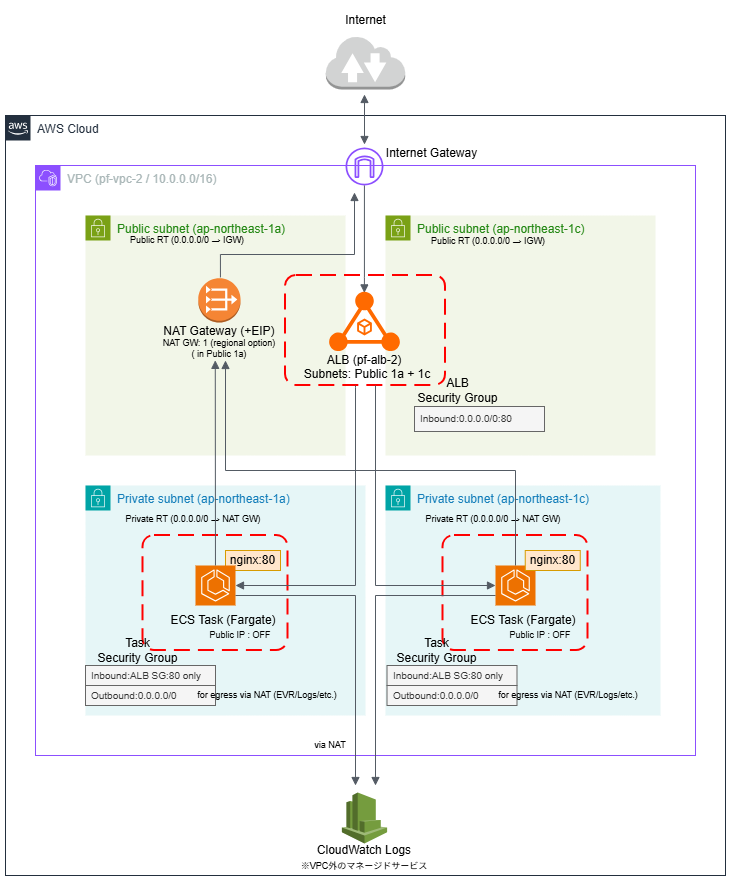

---

## 手順（再現可能）

### 0. 事前準備（最低限）
- Root アカウントの MFA 有効化
- 管理用 IAM ユーザー作成 + MFA
- AWS Budgets でアラート（例：月 $10、85%/100%）
- 注意：NAT Gateway は固定費が発生するため、作業後は削除する

### 1. VPC 作成（NATあり）
- VPC and more
- AZ：2
- Public Subnet：2
- Private Subnet：2
- NAT ゲートウェイ：VPC作成ウィザードの「NAT ゲートウェイ（新規）: リージョナル」を選択
- VPC Endpoint：なし
- Name：pf-vpc-2

確認（重要）
- Public RT：`0.0.0.0/0 -> IGW` がある
  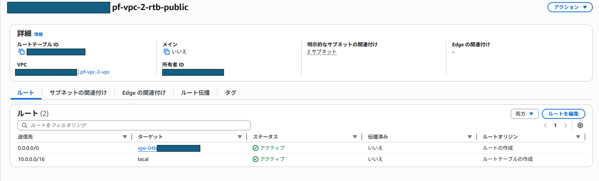

- Private RT：`0.0.0.0/0 -> NAT Gateway` がある
  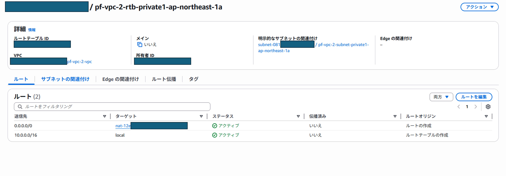

- Private Subnet が Private RT に関連付いている
  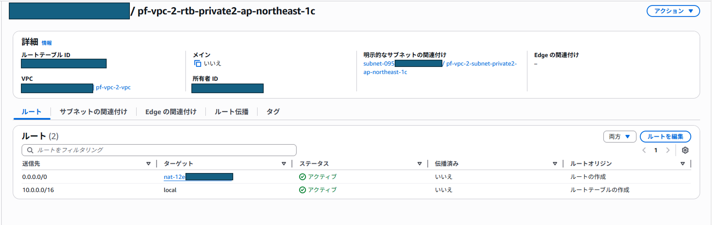

### 2. セキュリティグループ作成（Case B の要点）
- ALB SG：`pf-sg-alb-2`
  - Inbound：HTTP 80 from `0.0.0.0/0`
- Task SG：`pf-sg-task-nginx-2`
  - Inbound：HTTP 80 from **ALB SG のみ（pf-sg-alb-2）**
  - Outbound：`0.0.0.0/0`（最小成立として許可）
    - ※本番なら宛先/ポート制限を検討（要件次第）

補足（よくあるUIの詰まり）
- 既存の inbound ルール（CIDR：`0.0.0.0/0` など）の行に、後から SG 参照を入れようとしてエラーになる場合がある  
  → 対処：その行を削除し、**ソースが「セキュリティグループ」** の新規ルールとして追加する

### 3. ECS Cluster 作成（Fargate only）
- Cluster：pf-ecs-cluster-2
- Capacity provider：Fargate only

### 4. タスク定義作成（nginx）
- Task definition：pf-task-nginx-2
- Launch type：Fargate
- Network mode：awsvpc
- OS/Arch：Linux/x86_64
- Task size：
  - Task CPU：256
  - Task Memory：512 MiB
- Container：
  - Name：nginx
  - Image：nginx:1.28.1（タグ固定）
  - Port mapping：
    - containerPort：80
    - hostPort：80
    - protocol：tcp
- Logs（CloudWatch Logs / awslogs）：
  - awslogs-group：/ecs/pf-task-nginx-2
  - awslogs-region：ap-northeast-1
  - awslogs-stream-prefix：ecs
  - awslogs-create-group：true
- IAM role：
  - Task execution role：ecsTaskExecutionRole（自動作成）
    - 補足：ecsTaskExecutionRole は **ECR pull と CloudWatch Logs 出力**に必要
  - Task role：未設定（本Caseでは AWS API を呼ばないため不要）

### 5. サービス作成（ECS Service）+ ALB 作成
- Desired tasks：1
- Service：`pf-svc-nginx-2`
- Task definition：`pf-task-nginx-2:<revision>`
- Networking（タスク側）：
  - VPC:**pf-vpc-2 を選択**（デフォルトVPCを選ばない）
  - Subnet：**Private Subnet x2 のみを選択**
    - もし Public Subnet が混ざっていたら **×で外す**
  - Security group：既存の`pf-sg-task-nginx-2`を選択
  - Inbound rule：HTTP 80（コンテナポート） / ソース：ALB の Security Group（SG参照）
  - **Public IP：OFF（本Caseの成立条件）**
- Load balancing（ALB側）：
  - Application Load Balancer：有効、`pf-alb-2`を新規作成。ALBのSGは`pf-sg-alb-2`を選択
  - ALB Subnet：Public Subnet x2
  - Listener：HTTP:80
  - Target group：新規作成（`pf-tg-2`）
  - Target type：IP (ALB 作成時にない可能性あり）
  - Health check：path `/`（デフォルト想定）

注意（最頻出の混同）
- サブネット選択は **2箇所** あります。  
  - タスク用（Networking）：**Private**
  - ALB用（Load balancing / Network mapping）：**Public**  
  ここを混同すると「Target は Healthy なのに DNS に到達できない」が発生しやすいです。

### 6. SG を最終形に締める
作成直後に SG を見直し、意図した最終形になっていることを確認します。
- ALB SG：`pf-sg-alb-2`
  - Inbound：HTTP 80 from `0.0.0.0/0`
- Task SG：`pf-sg-task-nginx-2`
  - Inbound：HTTP 80 from **ALB SG のみ**
  - もし `0.0.0.0/0:80` が入っていれば削除する

### 7. 動作確認（合否判定）
- ALB の DNS 名へアクセスし、nginx の Welcome Page が表示されること  
  例：`http://<ALB-DNS>/`
- Target group `pf-tg-2` の Target が **Healthy** であること

---

## 検証結果（成立証跡）
以下が揃っていることをもって Case B は成立とする。

- ALB DNS へアクセスして nginx の Welcome Page が表示された
    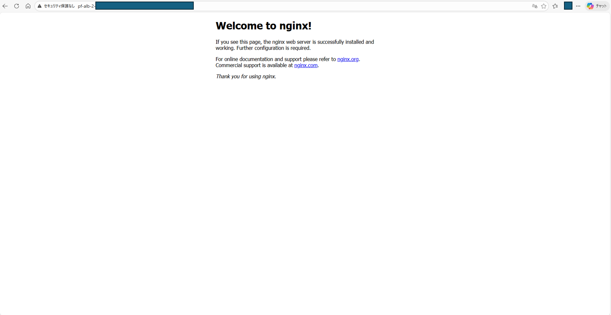

- Target Group が Healthy（ECS task が正常に登録されている）
    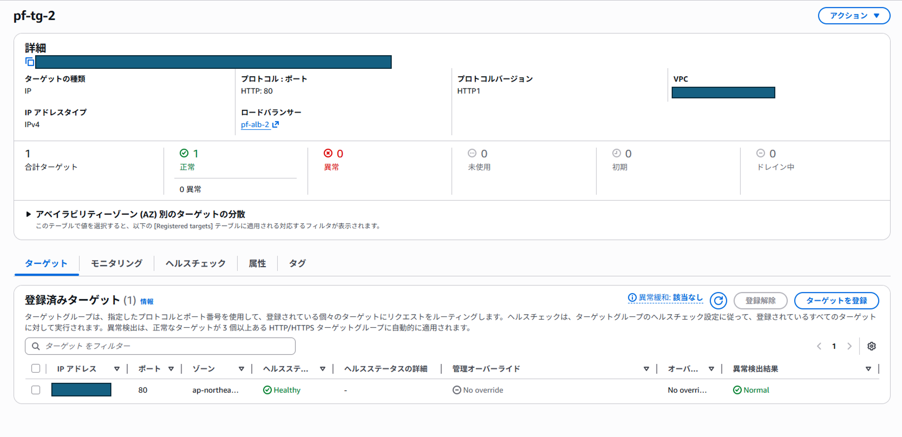

- CloudWatch Logs（nginx access log）に、User-Agent が `ELB-HealthChecker/2.0` のアクセスが継続して出ている
    ※これは「ALBのアクセスログ」ではなく「nginx側が受けたリクエストのログ」
    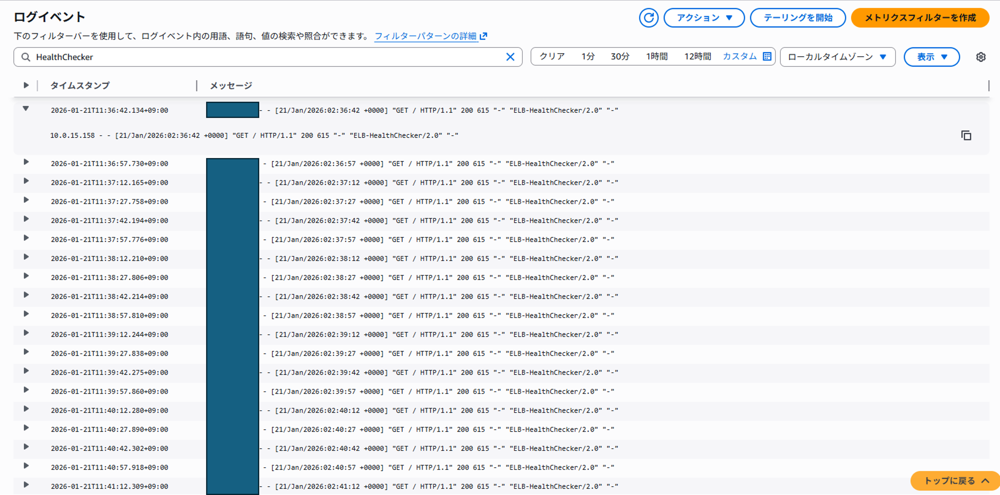

## 追加検証：異常系（404 応答とログ観測）
意図的に存在しないパスへアクセスし、ALB→Task→nginx まで到達して **404 が返ること**、および **nginx のログに記録されること**を確認する。

- 手順：
  - `http://<ALB-DNS>/test`（存在しない想定）へアクセスする
- 期待結果：
  - ブラウザ（または curl）で 404 が返る
  - CloudWatch Logs（nginx access/error）に該当リクエストが記録される
- 観測ログ例：
  - error log：`open() "/usr/share/nginx/html/favicon.ico" failed (2: No such file or directory)`
  - access log：`"GET /favicon.ico HTTP/1.1" 404 ...`

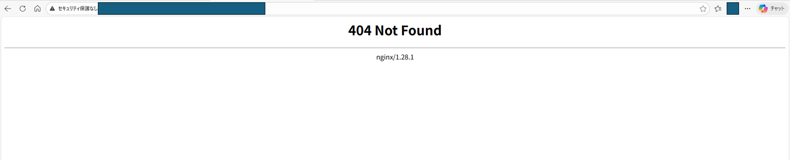
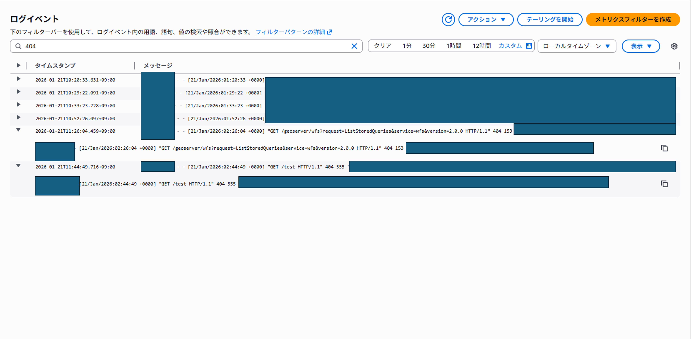

補足：404 が返ることは「到達している」証拠であり、必ずしも障害ではない。意図した異常系テストとして分類する。

---

## 障害対応 Runbook（切り分け手順）

### 0) まず固定する順序（迷子防止）
1. Target group の状態（Healthy/Unhealthy/Draining）
2. ECS サービスの Events（デプロイ/起動失敗理由）
3. CloudWatch Logs（起動しているか / リクエストが届いているか）
4. ALB（リスナー/ルール、セキュリティグループ、サブネット）
5. VPC（Public/Private RT、NAT、NACL）

補助コマンド（Windows例）
- 名前解決：`nslookup <ALB-DNS>`
- TCP疎通：`Test-NetConnection <ALB-DNS> -Port 80`
- HTTP確認：`curl -I http://<ALB-DNS>/`
---

### R1. 症状：タスクが起動しない（PENDINGのまま / STOPPEDになる）
**観測ポイント**
- ECS Service の Events
- 対象 Task の “Stopped reason”
  - 例：`CannotPullContainerError` / `ResourceInitializationError` / `Essential container in task exited`

**よくある原因と対処**
- `CannotPullContainerError` / `pull image ...` 系  
  - 原因（Case B 典型）：**NAT/ルート/Outbound 不備で外部へ出られず image pull 失敗**
  - 対処（この順）：
    1. サービスが **Private Subnet** を選んでいるか（Publicが混入してないか）
    2. **Assign public IP = OFF** になっているか（Case B の前提）
    3. Private RT に `0.0.0.0/0 -> NAT Gateway` があるか
    4. Private Subnet がその Private RT に関連付いているか
    5. NAT Gateway が `Available` か、EIP が付いているか
    6. Task SG Outbound が塞がれていないか（最小は 0.0.0.0/0 許可）
- `ResourceInitializationError` など  
  - 原因：実行ロール不足、初回利用時の揺らぎ、設定不整合
  - 対処：ecsTaskExecutionRole の存在確認 → 失敗スタック削除 → 再作成

**再発防止（固定）**
- Private Task は「NAT + Private RT + Subnet関連付け」をセットで確認する
- まず ECS events を見る（順序を崩さない）

---

### R2. 症状：Target Group が Unhealthy（ALB経由で表示されない）
**観測ポイント**
- Target Group → Targets の “理由”
  - 例：`Health checks failed` / `Request timed out`

**前提チェック（最優先）**
- Case B は **Task を Private Subnet 2つのみ**に置く。Public Subnet が混入していたら **×で外す**。
- Task が起動しない場合は R1 へ（Unhealthy以前に RUNNING になっていない可能性が高い）

**切り分け（この順）**
1) **Task SG inbound が ALB SG になっているか**
2) **ポート整合**（Listener 80 / TG 80 / containerPort 80）
3) **ヘルスチェック整合**（path `/`、成功コード想定がズレていないか）
4) **NACL / ルートの到達性**（Private側が到達不能になっていないか）

**対処**
- ALB 作成後に SG が確定してから、Task SG inbound を **ALB SG のみに**締める
- nginx access log に `ELB-HealthChecker/2.0` が来ているか確認
  - 来ていない：SG/ルート/NACL/ポートの可能性が高い
  - 来ているのに Unhealthy：ヘルスチェック設定（path/コード）を疑う

---

### R3. 症状：ALBにアクセスすると 502 / 504
**観測ポイント**
- ブラウザで 502/504、Target は Unhealthy になりやすい

**よくある原因**
- タスクが落ちている/起動できていない
- SG/NACL で ALB→タスク間が遮断

**対処**
- Target group の状態を確認（Unhealthyなら R2）
- ECS タスクの状態（RUNNING）と Events を確認
- Task SG inbound が ALB SG を許可しているか確認

---

### R4. 症状：CloudWatch Logs が出ない（ロググループ/ストリームが見えない）
**観測ポイント**
- `/ecs/pf-task-nginx-2` が作成されているか
- タスクが実際に RUNNING か（RUNNINGでないなら R1）

**原因と対処**
- awslogs 設定漏れ：タスク定義のログ設定を再確認  
- Execution role 不備：ecsTaskExecutionRole（Logs write）の確認  
- タスク停止：R1 に戻る（ログが出ないのは “動いていない結果” のことが多い）

---

### R5. 最短復旧チェックリスト
- [ ] ECS タスクが RUNNING
- [ ] Target group が Healthy
- [ ] ALB SG：80 from 0.0.0.0/0
- [ ] Task SG：80 from ALB SG のみ
- [ ] タスク用サブネット：Private のみ / Public IP OFF
- [ ] ALB用サブネット：Public x2
- [ ] `curl -I http://<ALB-DNS>/` が 200 OK

---

## つまずき（実例）

### つまずき1：ALB が Private Subnet に乗り、Target は Healthy なのに DNS へ到達できなかった
- 現象：Target group は Healthy だが、`http://<ALB-DNS>/` にアクセスできない（ブラウザが回り続ける）
- 原因：ALB の Network mapping が Private Subnet（`0.0.0.0/0 -> NAT` の RT）になっていた
- 対処：ALB のサブネットを Public Subnet x2（`0.0.0.0/0 -> IGW`）へ差し替え
- 再発防止：サブネット選択は **タスク用（Private）** と **ALB用（Public）** の2箇所であることを手順に明記

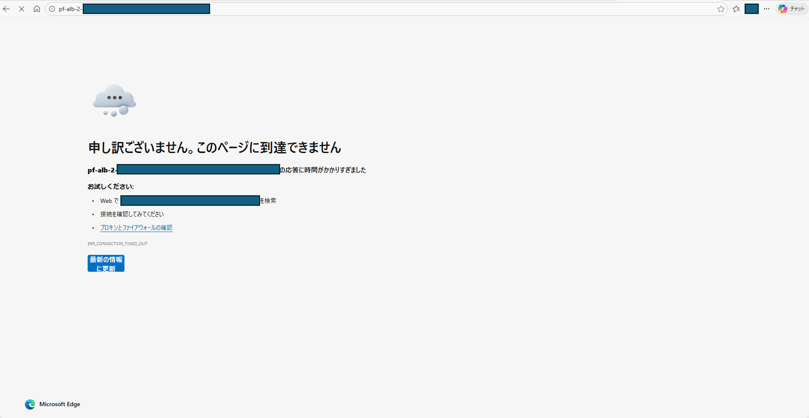
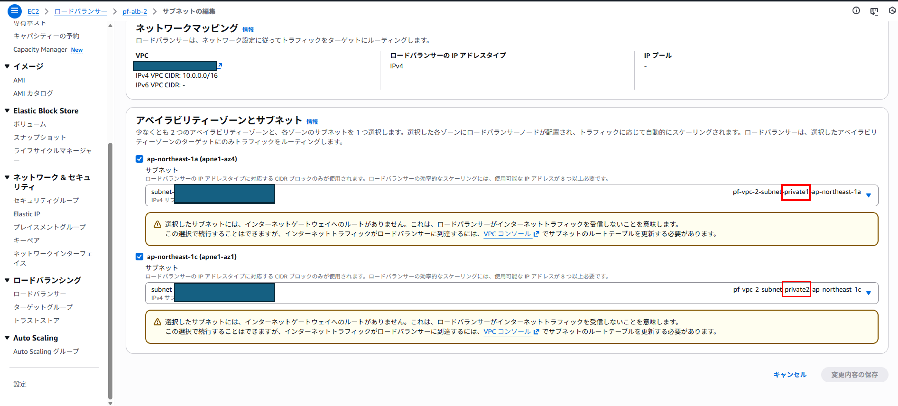
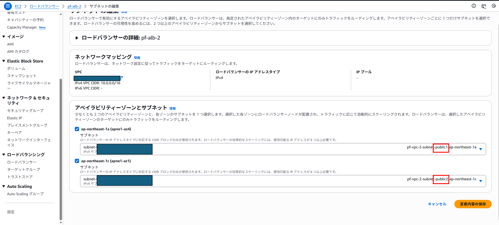

### つまずき2：ALB に Task SG が付与されており、ALB SG を別途用意できていなかった
- 現象：ALB の Security groups に `pf-sg-task-nginx-2` が付いてしまっていた
- 原因：ウィザードの表示範囲の都合で ALB SG が作られた前提で進め、実際の紐づけを確認していなかった
- 対処：`pf-sg-alb-2` を作成して ALB に付け替え、Task SG は ALB SG 参照で締めた
- 再発防止：**VPC作成直後に ALB SG / Task SG を先に作り、ECS/ALB では既存SGを選ぶ** に統一、手順書き換え実施

### つまずき3：ブラウザ確認が不安定で、コマンド確認（curl）で切り分けが確定した
- 現象：ブラウザでは到達できないように見える瞬間があった
- 観測：`Test-NetConnection -Port 80` は True、`curl -I http://<ALB-DNS>/` は安定して 200 OK
- 原因：設定変更直後の反映タイミングで誤判定しやすい
- 再発防止：動作確認は **(1) Target Healthy → (2) curl 200 OK → (3) ブラウザ** の順で固定

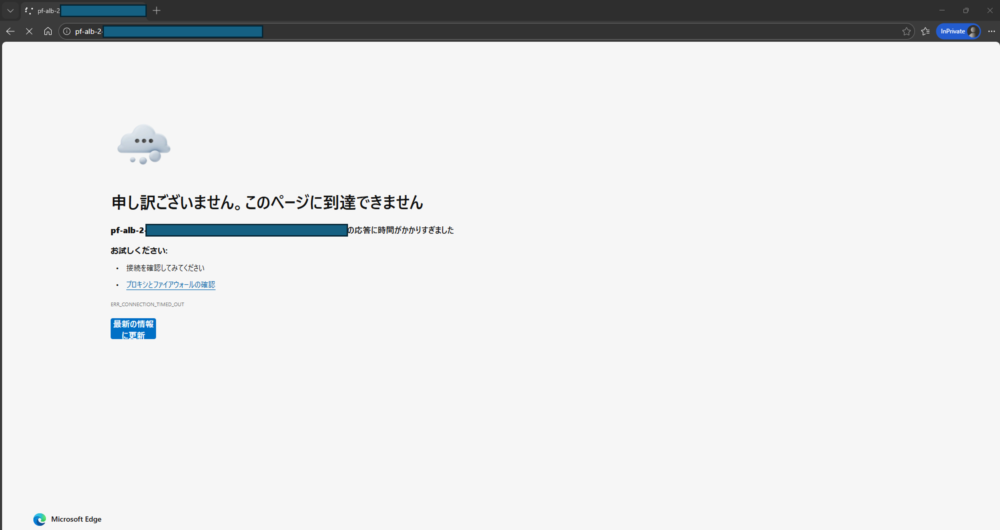
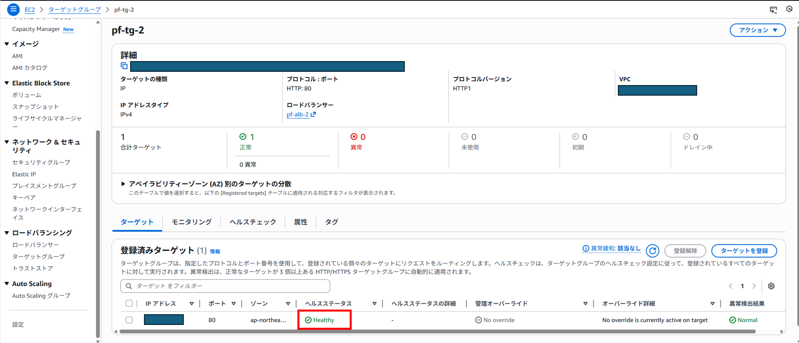
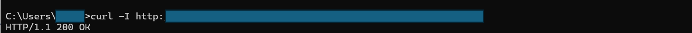

---

## コスト（固定費 / 従量）
- 固定費：**NAT Gateway（時間課金） + EIP（条件次第）**
- 従量：NAT Gateway データ処理、Fargate（CPU/Memory/実行時間）、ALB（時間＋LCU）、CloudWatch Logs（取り込み・保存）
- 学習用途でも放置すると積み上がるため、終わったら削除する（NATが最優先）

---

## 削除手順
1. ECS のサービス/タスクを停止・削除
2. ALB を削除（Listener はALB削除で消える。Target group は残る場合があるため別途削除）
3. Target group を削除（残っていれば）
4. NAT Gateway を削除（最優先）
5. EIP 解放を確認
6. セキュリティグループを削除（ALB SG / Task SG）
7. CloudWatch Logs のロググループを削除（`/ecs/pf-task-nginx-2`が不要なら）
8. CloudFormation スタックを削除（コンソール作成で生成された場合）
9. VPC を削除（依存が残ると消えないため、残存 ENI / RT関連 / IGW / サブネット等を順に削除）

---

## 削除完了チェック
削除作業後、以下が満たされていることを確認した。

- ECS（最初に確認）
  - Cluster `pf-ecs-cluster-2` に **Service が 0**、**Running task が 0** 確認後、削除
  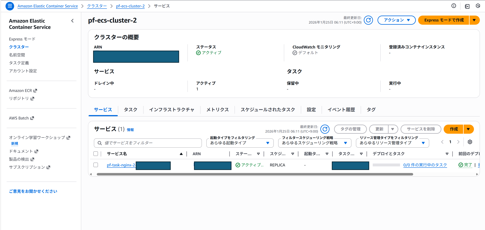
  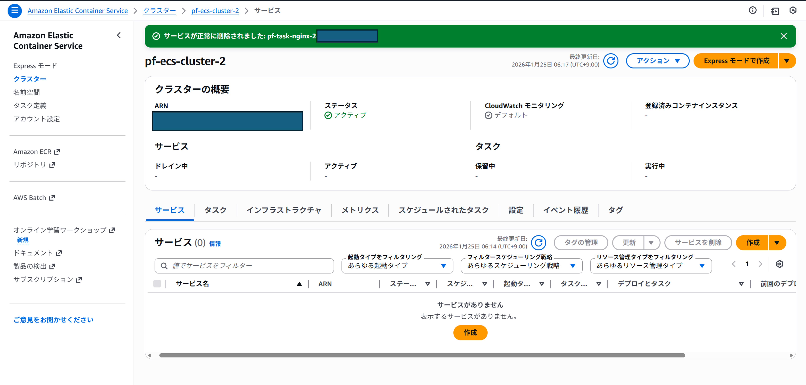

- ELB / Target group
  - EC2 → Load Balancers に対象 ALB が存在しない
  
  - EC2 → Target Groups に対象 TG（`pf-tg-2`）が存在しない  
    ※ALB 削除後も TG が残るケースがあるため別途確認
  

- NAT Gateway：存在しない（正常に削除されたことを確認）
  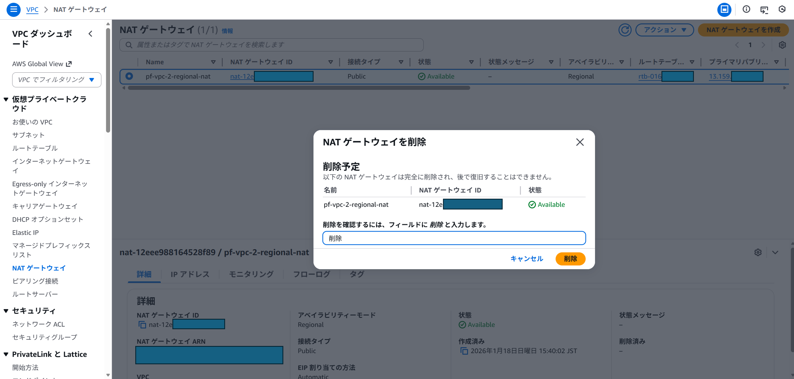
  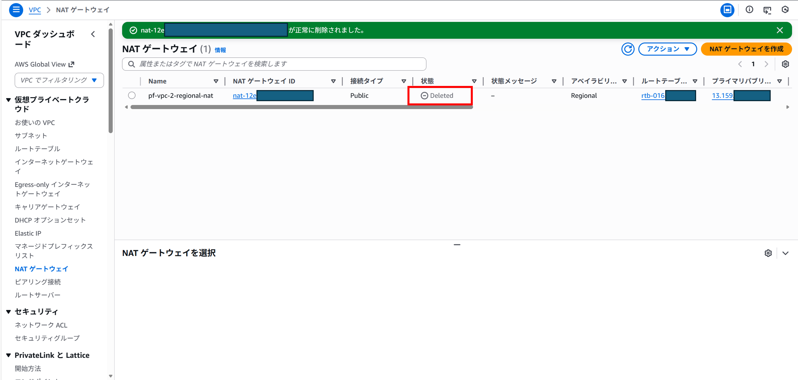

- Elastic IP：不要な割当（特に service-managed）が存在しない
  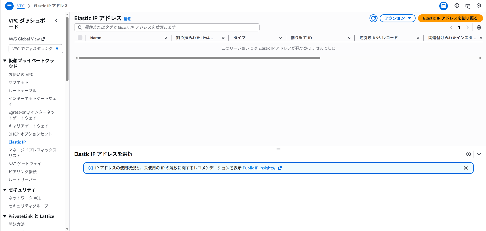

- Security group
  - `pf-sg-alb-2`  が存在しない  
  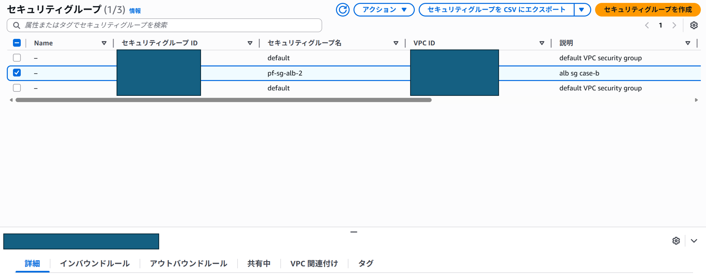
  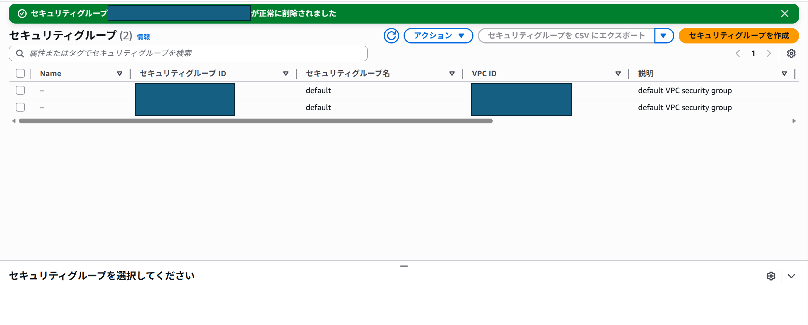

- CloudWatch Logs
  - `/ecs/pf-task-nginx-2` が（不要なら）削除されている
  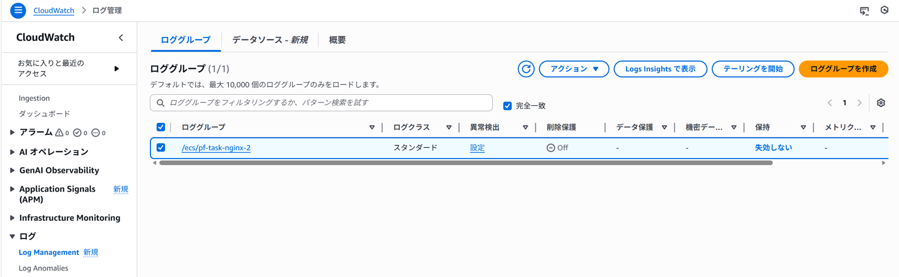
  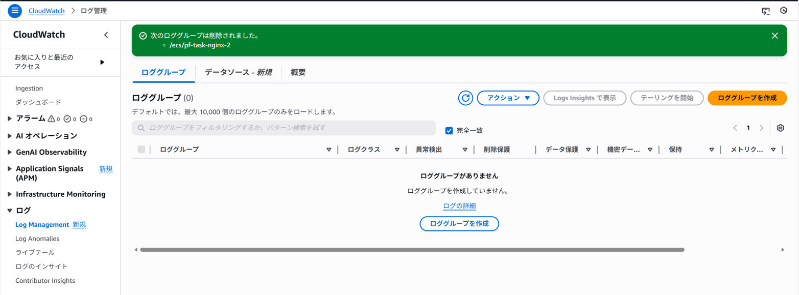

- CloudFormation（ECS コンソール作成で生成された場合）
  - CloudFormation → Stacks に関連スタックが残っていない（`DELETE_COMPLETE` を含め、残したくない場合は削除）
  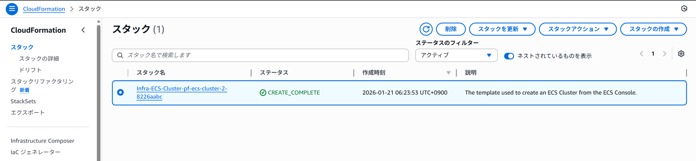
  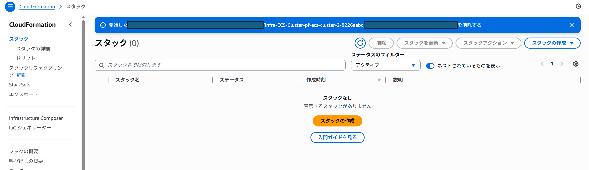

- VPC
  - `pf-vpc-2` が削除され、VPC 一覧に存在しない
  - VPC が削除できない場合は、残存リソース（ENI / SG / ルートテーブル関連付け / IGW / サブネット等）を逆引きして先に削除
  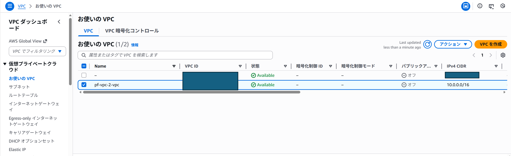
  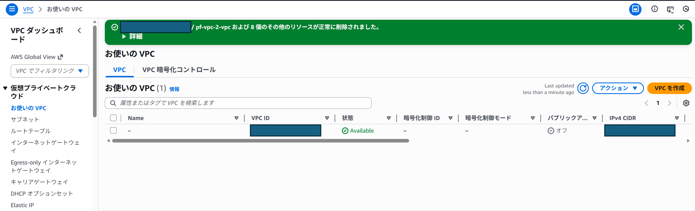

- ECS（最終確認）
  - （削除済みなら）Cluster 自体が一覧から消えている
  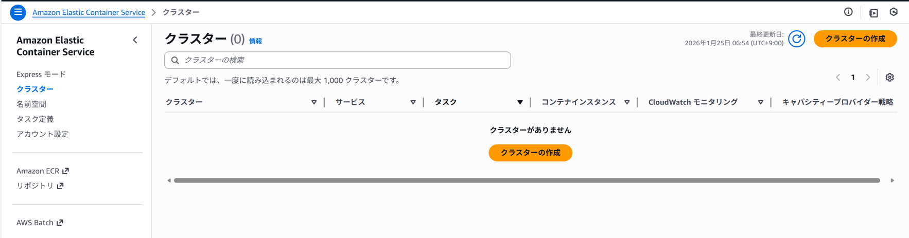

- Cost Explorer（翌日以降：今回の場合1月25日以降）：`NATGW-Hours` / `PublicIPv4:InUseAddress` が 0 近傍に戻っている
  
  

---

## まとめ
-  **Private Task + NAT** で、Public IP なしでも ECS（Fargate）+ ALB を成立させることができた
- つまずきやすい点は「サブネット選択が2箇所」「ALB SG と Task SG の取り違え」「SG設定変更直後のブラウザ確認が不安定」であった
- 動作確認は `curl` 等のコマンドも使用し、ブラウザだけで判断しない方が良い
- 次は Case C（Private + Endpoint を含む構成）で、Private 側の成立条件と切り分けを拡張する
- コストについては別md [case-b-cost-portfolio.md](./case-b-cost-portfolio.md)にまとめた。